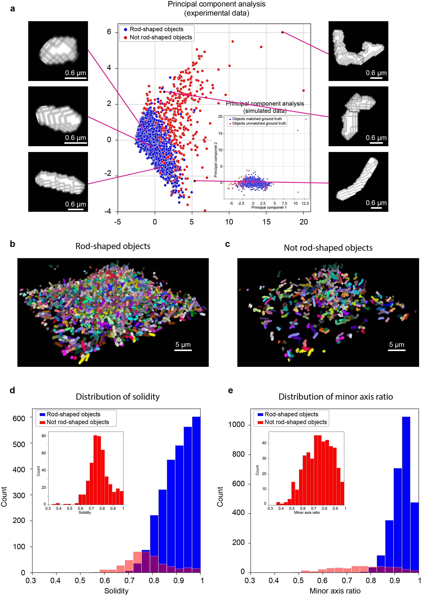

<!-- Improved compatibility of back to top link: See: https://github.com/othneildrew/Best-README-Template/pull/73 -->
<a name="readme-top"></a>
<!--
*** Thanks for checking out the Best-README-Template. If you have a suggestion
*** that would make this better, please fork the repo and create a pull request
*** or simply open an issue with the tag "enhancement".
*** Don't forget to give the project a star!
*** Thanks again! Now go create something AMAZING! :D
-->


<!-- PROJECT LOGO -->
<br />

<div align="center">
  <a href="https://github.com/GahlmannLab/BCM3D-2.0">
    
  </a>

<div align="left">

# BCM3D 2.0

<!-- ABOUT THE PROJECT -->

## About The Project

 BCM3D 2.0 is entirely complementary to the approach utilized in BCM3D 1.0. Instead of training CNNs to perform voxel classification, we trained CNNs to translate 3D fluorescence images into intermediate 3D image representations that are, when combined appropriately, more amenable to conventional mathematical image processing than a single experimental image. Using this approach, improved segmentation results are obtained even for very low SBRs and/or high cell density biofilm images.The improved cell segmentation accuracies in turn enable improved accuracies of tracking individual cells through 3D space and time. This capability opens the door to investigating time38 dependent phenomena in bacterial biofilms at the cellular level. 

<div align="center">
  <a href="https://github.com/GahlmannLab/BCM3D-2.0">
    
  </a>

<div align="left">

## Getting Started

This package was tested on a high-performace computing cluster at University of Virginia with CUDA-enabled GPU and Tensorflow 2.x

### Prerequisites

This package uses CSBdeep for training deep leanirng modules. Tensorflow 2.x with its dependencies (CUDA, cuDNN) is required. Please refer to CSBdeep for further instructions (http://csbdeep.bioimagecomputing.com/doc/install.html).

### Installation
1. create and activate a conda enviroment 
   ```sh
   conda create -n BCM3D2.0 python=3.8
   conda activate BCM3D2.0
   ```
2. pip install
   ```sh
   pip install BCM3D2.0
   ```

<!-- USAGE EXAMPLES -->
## Usage

#### Model training

1. Use **src/IntermediateImageGenerate.py** to generate image representations from ground truth cell arrangement.

2. Use **dategen.ipynb** to generate training pairs (raw data and the corresponding image representations).

3. Use **train.ipynb** to train CNNs that will train a model.

#### Prediction

1. Use **src/preprocess.py** to apply background substraction to raw data. (optional)

2. Use **predict.ipynb** to generate segmentations


<!-- LICENSE -->


## License

Distributed under the MIT License. See `LICENSE.txt` for more information.

<p align="right">(<a href="#readme-top">back to top</a>)</p>

<!-- CONTACT -->
## Contact

 yw9et@virginia.com; jz3nc@virginia.edu; ag5vu@virginia.edu

Project Link: https://github.com/GahlmannLab/BCM3D-2.0

Data Link: https://osf.io/m4637

<p align="right">(<a href="#readme-top">back to top</a>)</p>


